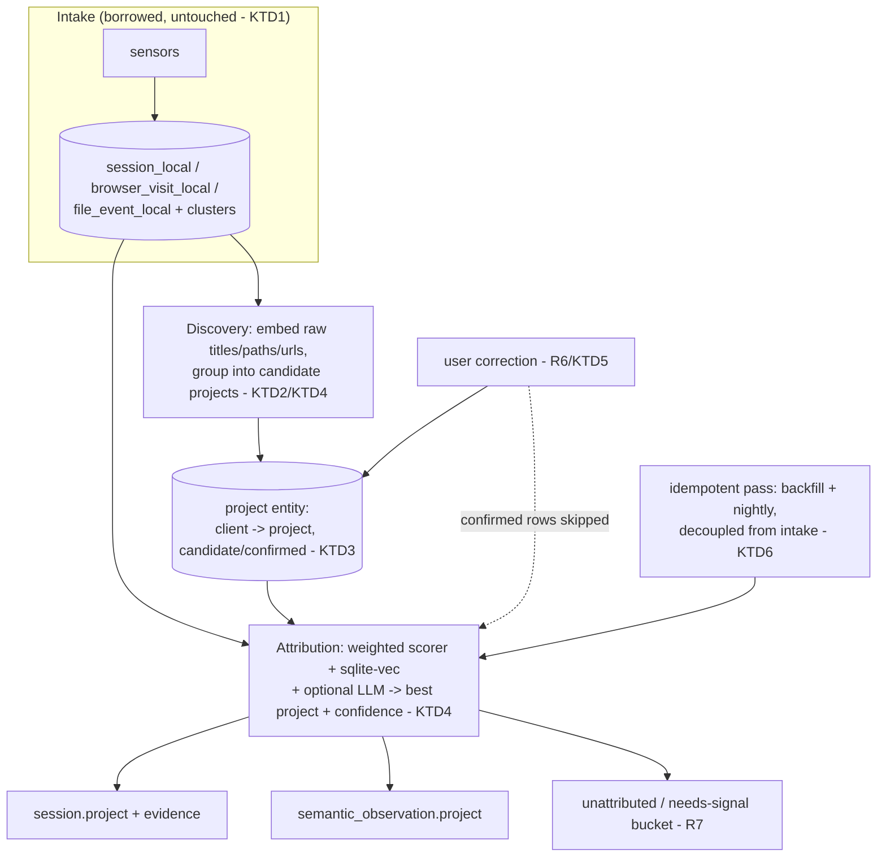

# Auto Project Attribution - Plan

## Goal Capsule

**Objective:** Every hour WorkPulse records is automatically attributed to the real project it belongs to (e.g. "Verst Carbon → MADDs Kenya/Zambia"), with no hand-authored keyword taxonomy and no manual stream tagging — so the product reports work, not apps.

**Means:** On a fresh canonical branch cut from `origin/main`, replace the keyword-file bottleneck in the existing cluster → categorize pipeline with a semantic auto-discovery + attribution engine, and attribute both the already-collected sessions and the 134 orphaned semantic observations (KTD1, KTD2, KTD3).

**Product authority:** This plan owns the attribution backbone only. Reviving deep/screenshot/OCR capture and synthesizing methodology documents are the next two slices (see How This Work Fits Together) and are not active scope.

**Execution profile:** Backbone of Pulse-as-a-commodity. Robustness outranks speed of delivery — every unit is test-first (superpowers TDD), and the engine must satisfy R8/R9/R10 (idempotent re-runs, safe degradation, never block intake) before it is considered done.

**Branch strategy:** Work happens on a new branch (e.g. `pulse-core`) cut from `origin/main`. `main` and `from-first-principles` are frozen as legacy references and are not developed further. The live database is reused as-is — no data reset (KTD1).

**Stop conditions:** Do not rewrite intake, sensors, or the storage substrate — borrow them (KTD1). Do not begin slice 2 (deep-capture revival) or slice 3 (methodology). Do not migrate to a new database or reset data.

**Open blockers:** None. The two former architecture questions are resolved as KTD1 (branch/substrate) and KTD4 (semantic-matching approach).

## Product Contract

### Summary

Turn WorkPulse's rich-but-unattributed activity data into project-level time and workflow attribution that discovers projects on its own, corrects itself from user feedback, and is robust enough to be the commodity backbone Pulse is built on.

### Problem Frame

WorkPulse already captures rich semantic signal (window titles, file paths, URLs, calendar) and even retains it privately in the `*_local` tables. A full attribution pipeline exists: nightly clustering, then `categorize.py` scoring clusters against `config/projects.yaml`. But the whole pipeline hinges on hand-authored keyword lists in `projects.yaml`. Attribution fires only when a title contains a keyword the user pre-registered.

The cost is concrete and daily: the user's largest active work — "Verst Carbon → MADDs Kenya/Zambia", "Kenya CARTA ESIA", the Strathmore dissertation — is not in the 7-stream taxonomy, so those hours fall through to "5h Safari, 2h Claude." The tool can only report app time unless the user keeps a keyword file current. That manual burden is why it "feels too manual to own." The same gap orphans the deeper layer: 134 `semantic_observation` rows (workflow stages, frictions) already exist but carry an empty `stream`, so even "you did 3h of analysis" cannot say analysis on what.

### Key Decisions

- **Project-level attribution (B) is the primary axis; deliverable-level (C) is on-demand drill-down.** (session-settled: user-directed — chosen over coarse-stream-only (A) and deliverable-default (C): B matches how work is actually reported; A/C fall out as roll-up/drill-down.) Governs R4.
- **The project taxonomy is discovered from the user's data, not pre-declared.** The hand-authored keyword file stops being the mechanism for adding projects. (session-settled: user-directed — chosen over maintaining `projects.yaml`: the manual taxonomy is the stated failure.) Governs R1, R2.
- **Attribution is automatic with a correct-me loop, not confirm-first.** (session-settled: user-approved — chosen over requiring confirmation before an assignment counts: minimizes manual work while keeping trust via correction.) Governs R6.
- **This slice is the robust backbone; deep-capture revival is deferred to slice 2.** (session-settled: user-approved — chosen over folding capture-revival into this plan: a smaller, fully tested foundation is what "must not break after a few trials" requires.) Governs R8, R9, R10, R12.
- **Backbone-grade robustness is a first-class requirement, not a quality nicety.** This is the commodity core of Pulse. (session-settled: user-directed.) Governs R8, R9, R10.

### Requirements

**Attribution engine**

R1. Every session is assigned to an inferred project from its raw semantic signal (`session_local.raw_title`/`raw_path`/`raw_files`, `browser_visit_local.raw_url`/`raw_title`, calendar), without reference to a hand-authored keyword taxonomy.

R2. The project taxonomy is discovered from the user's own data: the system proposes projects (client → project) it observes, and the user never edits a keyword file to make a new project attributable.

R3. Attribution is semantic, not substring keyword matching: paraphrased, abbreviated, or previously-unseen titles resolve to the right project when their meaning matches it.

R4. Project-level is the default attribution granularity; deliverable/output-level is available as an on-demand drill-down, not the primary axis.

R5. Each attribution carries a confidence score and its supporting evidence, so low-confidence assignments are distinguishable and reviewable.

**Trust and correction**

R6. A user correction is captured and improves future attribution beyond the corrected row, following the existing proposed → confirmed correction pattern; corrections are never overwritten by a later automatic pass.

R7. Sessions whose signal is genuinely insufficient to attribute (e.g. Claude's window title is only "Claude") land in an explicit "unattributed / needs signal" bucket — never silently misattributed and never dropped.

**Robustness (backbone)**

R8. Attribution runs over the full historical backlog (~45k sessions, ~3 months) and over new activity continuously; re-running is idempotent — it never duplicates, loses, or corrupts prior attributions or user corrections.

R9. The engine degrades safely: a model/LLM outage, a malformed record, or a partial run leaves the database consistent and resumable, and never blocks or slows intake — the silent watcher keeps recording regardless.

R10. Attribution behavior is covered by tests that fail if it regresses, including backlog re-run idempotency, correction persistence, the unattributed path, and correct resolution of known projects drawn from the user's real data.

**Downstream contract**

R11. Attribution writes to a stable project entity that both `session` and `semantic_observation` reference by a new `project_id` link; the 134 existing observations (and future ones), which currently have no project, are attributed. The legacy `stream` column stays for compatibility and may be derived from the project's client.

R12. The way a project is identified and referenced is defined as an explicit contract so slice 2 (deep capture) and slice 3 (methodology synthesis) consume it without schema rework.

**Surfacing**

R13. The dashboard presents time and activity by project (augmenting or replacing the by-app view), with drill-down to deliverable level (C) and to the evidence behind any attribution.

### Key Flows

F1. **Attribution pass (scheduled or on-demand).** **Trigger:** nightly run or manual invoke. Discover/refresh the project taxonomy from recent raw signal → attribute new and previously-unattributed sessions → attribute `semantic_observation` rows → flag low-confidence assignments for review. **Covers R1, R2, R3, R5, R7, R11.**

F2. **Correction.** **Trigger:** user reassigns a session/cluster to a different (or new) project in the dashboard. The correction is stored, the taxonomy updates if a new project was named, and subsequent passes honor it and generalize from it. **Covers R6.**

F3. **Backfill.** **Trigger:** first run, or re-run after an engine change. Attribution processes the entire backlog; a second run over the same data changes nothing already correct and re-touches nothing the user has corrected. **Covers R8.**

### Acceptance Examples

AE1. **Covers R2, R3.** A Word session titled `Verst Carbon_Development of MADDs in Kenya and Zambia_Engagement_Letter` is attributed to a discovered project like "Verst Carbon → MADDs Kenya/Zambia" even though no such keyword exists in today's `projects.yaml`.

AE2. **Covers R7.** A Claude session whose only title is `Claude`, with no corroborating file/browser/calendar signal in its window, is placed in the unattributed bucket rather than guessed onto a project.

AE3. **Covers R8.** Running the attribution pass twice over the same backlog yields identical attributions the second time, and leaves every prior user correction intact.

AE4. **Covers R6.** After the user reassigns a session from "BD" to "Verst Carbon → CARTA ESIA", later sessions with similar signal attribute to CARTA, and no automatic pass reverts the corrected session.

AE5. **Covers R9.** If the semantic-matching backend is unavailable mid-pass, the run stops cleanly with the database consistent and resumable, intake is unaffected, and the next pass continues from where it stopped.

### Success Criteria

- On the ~3-month backlog, the large majority of active work hours land on a named project rather than app-only — including projects absent from today's `projects.yaml` (Verst Carbon MADDs, CARTA ESIA, dissertation).
- "How many hours on MADDs this week?" is answerable from the dashboard with zero manual stream tagging.
- Attribution is stable and lossless across repeated runs (R8/AE3 hold), and the test suite covering it is green.
- The 134 existing semantic observations become project-attributed.

### Scope Boundaries

**In scope:** semantic auto-discovery of the project taxonomy; project-level attribution of sessions with deliverable-level drill-down; confidence + evidence; the correction loop; backlog backfill; attributing existing `semantic_observation` rows; the downstream project-reference contract; by-project dashboard surfacing; the test coverage that makes it backbone-grade.

**Deferred for later (slice 2):** reviving and expanding deep semantic / screenshot / OCR capture (`workpulse/core/semantics.py`).

**Deferred for later (slice 3):** methodology-document synthesis (filling `workflow_method`) and efficiency coaching.

**Outside this slice's identity:** maintaining a hand-authored keyword taxonomy as the way projects are added (explicitly being removed as the mechanism); multi-user / team attribution.

<!-- ce-section: work-relationships -->
### How This Work Fits Together

This plan owns one area — the **attribution backbone**. The broader breakdown below is the current shared understanding from brainstorming, not a committed roadmap; a later plan may revise, split, or merge it.

- **Slice 1 — Auto project attribution** (this plan). The project axis every other layer needs.
  - **Slice 2 — Revive + attribute deep capture.** `Depends on` slice 1's project-reference contract (R12). Un-strands `workpulse/core/semantics.py`, gets workflow stages/frictions flowing again and pinned to projects. `Enables` slice 3.
  - **Slice 3 — Methodology synthesis + coaching.** `Depends on` slices 1 and 2. Turns attributed stages/frictions into "how George writes proposals" documents (`workflow_method`) and efficiency coaching. This is the north-star output.

### Dependencies / Assumptions

- Raw semantic content remains populated and available in the `*_local` tables (verified: 100% of 45,444 sessions carry `raw_title`).
- `sqlite-vec` is available in the substrate for embedding-based matching (KTD4).
- `origin/main` is the proven substrate: it is what the packaged app runs, it writes the live database, and it holds the fullest codebase (`workpulse/core/*`, migrations 0001-0010). The fresh branch is cut from it (KTD1).
- The live database is reused unchanged; no schema reset or data migration is in scope (KTD1).

### Outstanding Questions

**Deferred to Implementation** (non-blocking)

- Confidence threshold separating auto-accepted from review-flagged attributions — tune against the real backlog once the scorer runs. (R5.)
- Whether the attribution unit is the existing cluster or moves to per-session/per-window — decide when the engine reads real cluster quality. (R1, R4; KTD3.)
- Exact embedding model/dimension for `sqlite-vec` and whether titles are embedded per-session or per-distinct-title. (R3; KTD4.)

### Sources / Research

- `workpulse/core/categorize.py` — existing weighted-signal cluster scorer (`title_keyword +2`, path, calendar, browser, `existing_stream`) and `resolve_match` against the project taxonomy. The scorer to keep as the deterministic baseline (KTD4).
- `workpulse/core/projects.py` + `config/projects.yaml` (live: `~/Library/Application Support/Pulse/Personal/config/projects.yaml`) — the hand-authored keyword taxonomy that is the current bottleneck; becomes machine-managed (KTD2).
- `workpulse/core/semantics.py`, migration `workpulse/migrations/0009_semantic_observations.sql`, tables `semantic_observation` / `semantic_evidence_local` — the deep-capture layer (134 rows, stages + frictions, empty `stream`) whose observations this slice attributes.
- `workpulse/core/consolidate.py`, `workpulse/core/name_clusters.py` — existing readers of `raw_title` (token bags, cluster naming) to reuse.
- `workpulse/core/cluster.py`, `workpulse/core/db.py`, `workpulse/core/atoms.py` — clustering, substrate, and atom writers borrowed unchanged.
- `workpulse/core/llm.py` — existing LLM integration for optional taxonomy proposal/naming (KTD4).
- `session_local` / `browser_visit_local` / `file_event_local` — retained raw signal the engine reads.
- Correction precedent: `cluster_correction`, `cluster_name`, and the `workflow_method` `candidate → confirmed` lifecycle (KTD5).

---

## Planning Contract

### Key Technical Decisions

KTD1. **Cut a fresh branch from `origin/main`; borrow the substrate and reuse the live database.** Build on the proven `workpulse/` package; freeze `main` and `from-first-principles` as legacy. Do not rewrite intake, sensors, or storage. (session-settled: user-directed — chosen over building on `from-first-principles`, a fresh DB, or full greenfield: `main` is the substrate that ships, holds the data, and has the fullest codebase; rewriting working intake/storage fails the robustness bar.) Governs R8, R9, R11.

KTD2. **The project taxonomy is machine-managed, not hand-authored.** Auto-discovery writes projects to a `project` entity; `config/projects.yaml` is demoted to an optional seed/override and is never the way a new project becomes attributable. Governs R1, R2, R11, R12.

KTD3. **Two-level project model: client/domain → project, with deliverable as an optional third level surfaced on demand.** Attribution targets the project level; deliverable is derived for drill-down, not stored as the primary axis. Governs R4.

KTD4. **Hybrid semantic matching, local-first.** Keep the existing deterministic weighted-signal scorer (`workpulse/core/categorize.py`) as the always-available, zero-key baseline; add `sqlite-vec` embedding similarity for taxonomy discovery and fuzzy attribution; use the existing `workpulse/core/llm.py` only for taxonomy proposal/naming and hard cases, degrading to embeddings-plus-rules when no key is present. (session-settled: user-approved — chosen over LLM-only or embeddings-only: satisfies local-first and R9 safe-degradation.) Governs R1, R3, R9.

KTD5. **Attributions and corrections are durable records a re-run never overwrites.** A correction moves a project `candidate → confirmed` and feeds discovery; automatic passes skip user-confirmed rows. Governs R6, R8.

KTD6. **Attribution is a separate idempotent pass, decoupled from intake.** It extends the nightly job and is runnable on demand; it reads the DB and writes attributions, and never runs inside the sensor path, so a slow or failed pass cannot block or slow recording. Governs R8, R9.

### High-Level Technical Design

Authoritative content is the prose and IDs; the diagram is an on-ramp.

### Assumptions and Constraints

- Never run attribution inside the sensor/intake path (KTD6, R9).
- A re-run is safe at any time and changes nothing already correct or user-confirmed (R8, KTD5).
- Local-first: the engine produces a usable result with no API key (KTD4).

### Sequencing

U1 → U2 → U3, then U4 and U5 in parallel off U3, then U6 (backfill/orchestration), then U7 (surfacing). Branch setup precedes U1 (see Definition of Done).

---

## Implementation Units

### U1. Project entity and schema migration

- **Goal:** Add a durable `project` entity and the columns that link sessions and semantic observations to it, without disturbing existing data.
- **Requirements:** R11, R12; supports R4.
- **Dependencies:** none.
- **Files:** `workpulse/migrations/0011_project_attribution.sql` (new), `workpulse/core/projects.py`, `tests/test_projects.py`.
- **Approach:**
  1. New migration adds a `project` table (id, client, name, status `candidate|confirmed|dismissed`, confidence, created_at, confirmed_at) per KTD3/KTD5.
  2. Add nullable `project_id` to `session` and to `semantic_observation` (per KTD2, R11); add an attribution-evidence/confidence store (reuse the `cluster_correction` shape for corrections per KTD5).
  3. Migration is additive and idempotent; existing rows keep `project_id` NULL until attributed.
- **Patterns to follow:** existing migrations `workpulse/migrations/0008..0010`; atom writers in `workpulse/core/atoms.py`.
- **Test scenarios:**
  - Applying the migration on a copy of the live DB adds the table/columns and loses no existing rows.
  - Re-applying the migration is a no-op (idempotent). Covers AE3.
  - A session and a semantic_observation can be linked to a project and read back.
- **Verification:** migration applies cleanly on a live-DB copy; schema round-trips; `test_projects.py` green.

### U2. Taxonomy auto-discovery

- **Goal:** Propose the two-level project taxonomy from raw signal, with no hand-authored keywords.
- **Requirements:** R2, R3; supports R1.
- **Dependencies:** U1.
- **Files:** `workpulse/core/discovery.py` (new), `workpulse/core/projects.py`, `workpulse/core/llm.py`, `tests/test_discovery.py` (new).
- **Approach:**
  1. Read distinct `raw_title`/`raw_path`/`raw_files`/`raw_url` (reuse readers in `workpulse/core/consolidate.py`, `name_clusters.py`).
  2. Embed with `sqlite-vec` and group into candidate projects; derive client→project structure per KTD3.
  3. Optionally name/refine candidates via `llm.py`; when no key, fall back to token-frequency naming (KTD4). Write candidates to the `project` table as `candidate`.
- **Patterns to follow:** `workpulse/core/name_clusters.py` (raw_title frequency), existing `sqlite-vec` usage in `workpulse/core/search.py`.
- **Test scenarios:**
  - Covers AE1. Given fixture titles including `Verst Carbon_Development of MADDs in Kenya and Zambia_Engagement_Letter`, discovery proposes a "Verst Carbon → MADDs" project without any keyword config.
  - With no LLM key, discovery still produces named candidates (degrades to token naming). Covers AE5 (partial).
  - Re-running discovery does not duplicate an existing candidate for the same cluster.
- **Verification:** on a live-DB copy, discovery proposes projects covering the user's known active work (Verst Carbon, dissertation, WorkPulse) absent from today's `projects.yaml`.

### U3. Semantic attribution engine

- **Goal:** Assign each session to a project with confidence and evidence, or to the unattributed bucket.
- **Requirements:** R1, R3, R5, R7; supports R4.
- **Dependencies:** U1, U2.
- **Files:** `workpulse/core/attribution.py` (new), `workpulse/core/categorize.py`, `tests/test_attribution.py` (new).
- **Approach:**
  1. Layer the hybrid matcher per KTD4: keep `categorize.py`'s weighted signals as the deterministic baseline, add `sqlite-vec` similarity between a session's raw signal and project candidates, optionally consult `llm.py` for low-margin cases.
  2. Emit best project + confidence + the contributing evidence (R5).
  3. Below a confidence floor, route to the unattributed/needs-signal bucket (R7) rather than guessing.
- **Patterns to follow:** `workpulse/core/categorize.py` `_WEIGHTS`/`gather_signals`/`_score`.
- **Test scenarios:**
  - Covers AE2. A Claude session whose only signal is the title `Claude` lands in the unattributed bucket.
  - A paraphrased/never-seen title semantically close to a known project attributes to it (R3).
  - Each attribution carries non-empty evidence and a confidence in [0,1] (R5).
  - With the semantic backend disabled, the deterministic baseline still attributes clear keyword/path matches (KTD4, R9).
- **Verification:** on the backlog, the large majority of active work hours attribute to a named project (Success Criteria).

### U4. Attribute existing semantic observations

- **Goal:** Fill the empty `stream`/project link on the 134 existing (and future) semantic observations.
- **Requirements:** R11.
- **Dependencies:** U1, U3.
- **Files:** `workpulse/core/semantics.py`, `workpulse/core/attribution.py`, `tests/test_semantics.py`.
- **Approach:**
  1. For each `semantic_observation`, attribute via its evidence sessions/source rows using the U3 engine; write `project_id`.
  2. An observation whose evidence is itself unattributed stays unattributed rather than guessed (R7).
- **Patterns to follow:** `semantic_evidence_local` join in `workpulse/core/semantics.py`.
- **Test scenarios:**
  - An observation backed by attributed sessions inherits their project.
  - An observation backed only by unattributed sessions stays unattributed.
  - Re-running does not overwrite a corrected observation project (KTD5).
- **Verification:** the 134 existing observations become project-attributed except those with genuinely insufficient evidence.

### U5. Correction loop

- **Goal:** Let a user reassign attributions, persist the correction, and improve future passes.
- **Requirements:** R6.
- **Dependencies:** U1, U3.
- **Files:** `workpulse/core/attribution.py`, `workpulse/core/feedback.py`, `workpulse/cli.py`, `tests/test_attribution.py`.
- **Approach:**
  1. A correction records the chosen project, moves a `candidate` project to `confirmed` when named, and is stored durably (KTD5).
  2. Discovery/attribution treat confirmed projects as high-signal anchors; automatic passes never overwrite a corrected row.
- **Patterns to follow:** `cluster_correction` / `cluster_name`, `workflow_method` `candidate → confirmed`.
- **Test scenarios:**
  - Covers AE4. Reassigning a session from "BD" to "Verst Carbon → CARTA ESIA" persists, and later similar sessions attribute to CARTA.
  - An automatic re-run does not revert a corrected session (KTD5, R8).
- **Verification:** corrections survive a full re-run and shift subsequent attributions.

### U6. Idempotent backfill and orchestration

- **Goal:** Run attribution over the full backlog and continuously, safely and repeatably, without touching intake.
- **Requirements:** R8, R9; supports R1.
- **Dependencies:** U3, U4.
- **Files:** `workpulse/ops/nightly.py`, `workpulse/core/attribution.py`, `workpulse/cli.py`, `tests/test_attribution.py`, `tests/test_nightly.py`.
- **Approach:**
  1. Add an on-demand + nightly attribution pass, decoupled from the sensor path (KTD6).
  2. Make the pass resumable and idempotent: it processes new/unattributed rows, skips confirmed rows, and a second run over the same data changes nothing.
  3. On backend failure mid-pass, commit progress transactionally and stop clean; the next pass resumes (R9).
- **Patterns to follow:** existing scheduled jobs in `workpulse/ops/nightly.py` / `workpulse/ops/scheduler.py`.
- **Test scenarios:**
  - Covers AE3. Two consecutive passes over the same backlog yield identical attributions and preserve corrections.
  - Covers AE5. A simulated backend outage mid-pass leaves the DB consistent and resumable; a subsequent pass completes.
  - Intake continues writing sessions while a pass runs (no lock contention on the sensor path).
- **Verification:** backlog attributed in one pass; re-run is a stable no-op; outage injection leaves a resumable state.

### U7. By-project dashboard surfacing

- **Goal:** Show time and activity by project, with drill-down to deliverable and to the evidence behind an attribution.
- **Requirements:** R13; surfaces R4, R5.
- **Dependencies:** U3, U6.
- **Files:** `workpulse/web/app.py`, `workpulse/web/static/dashboard.js`, `workpulse/web/static/dashboard.css`, `workpulse/web/static/index.html`, `tests/test_app.py` (or existing web test).
- **Approach:**
  1. Add a by-project view/endpoint that aggregates attributed time; keep the by-app view as a secondary lens.
  2. Drill-down: project → deliverable (KTD3), and attribution → its evidence + confidence (R5).
  3. Expose the correction action (U5) from the view.
- **Patterns to follow:** existing endpoints in `workpulse/web/app.py` (`/api/v2/today`, `/api/focus`, `/api/v2/streams`).
- **Test scenarios:**
  - The by-project endpoint returns hours grouped by project for a date range from attributed sessions.
  - Drill-down returns deliverable-level breakdown and the evidence for a given attribution.
  - A correction issued from the view persists (integration with U5).
- **Verification:** "hours on MADDs this week" is answerable in the dashboard with no manual stream tagging (Success Criteria).

---

## Verification Contract

- **Test runner:** `.venv/bin/python -m pytest`. Run the touched files per unit, then the full suite before done.
- **Backbone gates (must pass before done):**
  - Idempotency: two consecutive attribution passes over a live-DB copy produce identical attributions and preserve every correction (R8; U6/AE3).
  - Safe degradation: an injected backend outage mid-pass leaves the DB consistent and resumable, and intake is unaffected (R9; U6/AE5).
  - No data loss: migration and every pass run on a copy of the live DB without losing or corrupting existing rows (R8; U1).
  - Local-first: the engine attributes clear cases with no API key present (KTD4; U3).
- **Coverage gates:** each feature-bearing unit ships its named test file; AE1-AE5 are each covered by the linked scenarios above.
- **Real-data check (manual, non-CI):** on a copy of the live DB, discovery proposes the user's known active projects (Verst Carbon MADDs, CARTA, dissertation, WorkPulse) and the majority of active work hours attribute to a named project.

---

## Definition of Done

**Prerequisite:** the `pulse-core` branch is cut from `origin/main`; `main` and `from-first-principles` are left frozen (KTD1). All work and file paths are against the `workpulse/` package.

**Global:**
- All Implementation Units complete with their test files green, and the full `pytest` suite green.
- The four backbone gates in the Verification Contract pass (idempotency, safe degradation, no data loss, local-first) — R8/R9/R10 satisfied.
- The 134 existing semantic observations are project-attributed except those with genuinely insufficient evidence (R11).
- The by-project view answers project-level time queries with zero manual stream tagging (R13; Success Criteria).
- No dead-end or experimental code from abandoned approaches remains in the diff.
- The project taxonomy is machine-managed; `config/projects.yaml` is no longer required to add a project (R2; KTD2).

**Per-unit:** each unit's own **Verification** line is met.
