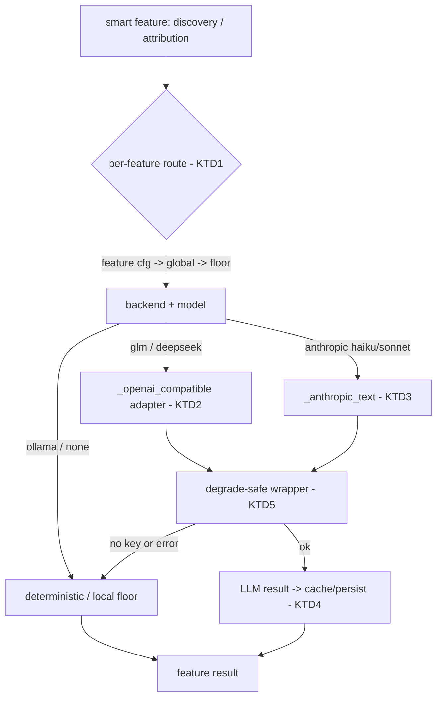

# Configurable LLM Provider + Smart Features - Plan

## Goal Capsule

**Objective:** WorkPulse's project discovery and attribution get materially better — a cleaner project taxonomy and higher coverage than the deterministic floor — using a model the user picks per feature (GLM, DeepSeek, Claude Haiku, or Claude Sonnet), while zero-key local-first operation keeps working unchanged.

**Means:** Extend `workpulse/core/llm.py` into a per-feature provider abstraction (add OpenAI-compatible GLM + DeepSeek backends; Haiku/Sonnet via anthropic model selection) and use it to assist attribution on the hard cases and to clean and name the discovered taxonomy (KTD1, KTD2).

**Product authority:** This plan owns slice A of the synthesis layer. Slice B (LlamaParse OCR capture) and slice C (synthesis API) are sequenced roadmap, not active scope.

**Execution profile:** Builds on the attribution backbone (branch `pulse-core`). Local-first is non-negotiable (KTD3): every provider call is an optional enhancement over the deterministic floor, and a missing key or a provider failure must degrade to the deterministic result, never break a pass or intake. Test-first (superpowers TDD); provider calls tested with mocks, no real keys.

**Stop conditions:** Do not build the synthesis API (slice C) or LlamaParse OCR (slice B). Do not replace the deterministic floor. Do not call the LLM on clearly-attributed sessions.

**Open blockers:** None.

## Product Contract

### Summary

Make the model a pluggable, per-feature choice, and use it to lift the attribution backbone above its ~20% deterministic floor: the LLM resolves the sessions the floor can't and cleans the noisy auto-discovered taxonomy — while a no-key install behaves exactly as it does today.

### Problem Frame

The attribution backbone works but its deterministic floor attributes only ~20% of sessions and its auto-discovered taxonomy carries noise (app/system names like "Whatsapp Secure Reliable", duplicate projects). The backbone deliberately left a KTD4 seam for an LLM to close this gap. Separately, the user wants freedom to run different models per feature — GLM, DeepSeek, Claude Haiku, or Claude Sonnet — rather than one hardcoded provider. Today `llm.py` supports only a single globally-selected backend (anthropic/ollama/gemini/none). This slice turns that seam and that provider rigidity into a configurable, local-first-safe capability.

### Key Decisions

- **Providers are GLM, DeepSeek, Claude Haiku, and Claude Sonnet, selectable per feature.** (session-settled: user-directed — chosen over a single global provider.) Governs R1, R2, R3.
- **The LLM assists; the deterministic floor leads.** The floor runs first (free); the LLM only resolves unattributed/low-confidence sessions and cleans/names the taxonomy. (session-settled: user-directed — chosen over LLM-first attribution and taxonomy-only.) Governs R6, R7.
- **Local-first is non-negotiable.** No key configured → every smart feature runs the deterministic/local path unchanged; a provider failure degrades to it. (session-settled: user-directed, from PLAN.md.) Governs R4, R5.
- **This slice is provider-layer + smart-features only.** OCR (slice B) and the synthesis API (slice C) are deferred. (session-settled: user-directed via the coherent-work split.)

### Requirements

**Provider layer**

R1. `llm.py` supports GLM (Zhipu) and DeepSeek as backends alongside the existing anthropic / ollama / gemini / none.

R2. Claude Haiku and Claude Sonnet are selectable as models on the anthropic backend.

R3. Each smart feature selects its provider and model via config; a feature with no explicit setting falls back to a global default, then to the local floor.

R4. With no provider key configured, every smart feature runs the deterministic/local path and produces the same result as the current backbone — zero-key operation is unchanged.

R5. A provider or network failure degrades to the deterministic result for that feature and never blocks the attribution pass or intake.

**Smart-feature enhancement**

R6. Attribution calls the LLM only for sessions the deterministic floor left unattributed or low-confidence; a clearly-attributed session never incurs an LLM call.

R7. Discovery uses the LLM to clean and name the candidate taxonomy — merging duplicates and replacing app/noise names with real project names (client → project).

R8. LLM-derived attributions and taxonomy names are persisted so a re-run does not re-call the model for unchanged inputs (bounded, idempotent cost).

R9. A user correction overrides any LLM result; the correction loop stays authoritative.

**Control and observability**

R10. The active provider and model per feature, and whether the LLM path actually ran, are inspectable (extends `backend_status`).

R11. LLM usage is bounded per pass and reported (call counts and rough cost), so cost is predictable before it is incurred at scale.

**Privacy**

R12. Before any cloud LLM call, obvious PII and client identifiers in the title/text sent to the provider are redacted; the local deterministic path always operates on the raw title, and nothing about redaction changes what is stored locally.

### Acceptance Examples

AE1. **Covers R4.** With no provider key set, running the attribution pass produces byte-identical project assignments to the current deterministic backbone.

AE2. **Covers R6.** A session the deterministic floor already attributes with high confidence produces no LLM call during a pass.

AE3. **Covers R5.** When the configured provider returns an error mid-pass, the affected sessions fall back to their deterministic result, the pass completes, and intake is unaffected.

AE4. **Covers R7.** A noisy candidate like "Whatsapp Secure Reliable" or two near-duplicate MADDs candidates are cleaned/merged into a sensible named project after an LLM taxonomy pass.

AE5. **Covers R3.** Config routing attribution to DeepSeek and taxonomy naming to Claude Sonnet causes each feature to call its own provider.

### Success Criteria

- With a provider configured, attribution coverage on the backlog rises meaningfully above the ~20% deterministic floor.
- Auto-discovered taxonomy noise (app/system names, duplicate projects) is materially reduced.
- A no-key install shows no behavior or result change from the current backbone (no regression).
- Cost per pass is bounded and reported; a re-run over unchanged data makes no new LLM calls.

### Scope Boundaries

**In scope:** GLM/DeepSeek/Haiku/Sonnet provider abstraction; per-feature routing with local-floor fallback; LLM-assist attribution on hard cases; LLM taxonomy cleanup/naming; persistence + cost bounding; safe degradation; per-feature observability.

**Deferred for later (slice B):** LlamaParse OCR deep content capture (`workpulse/core/content_capture.py`).

**Deferred for later (slice C):** the synthesis API — project summaries, weekly narratives, coaching (`workpulse/core/workflows.py`, migration 0008).

**Outside this slice's identity:** replacing the deterministic floor; calling the LLM on every session; a public/external API.

<!-- ce-section: work-relationships -->
### How This Work Fits Together

This plan owns one area — the **provider layer + LLM-enhanced smart features**. The broader breakdown is the current shared understanding, not a committed roadmap.

- **Slice A — provider layer + smart features** (this plan). The model foundation both other slices need.
  - **Slice B — LlamaParse OCR deep capture.** `Can proceed independently of` A; enriches the raw signal (document content, not just titles) that later attribution and synthesis consume.
  - **Slice C — synthesis API.** `Depends on` A (needs a configured provider). Turns attributed stages/frictions into project summaries, weekly narratives, and coaching (the dormant `workflow_method` scaffolding).

### Dependencies / Assumptions

- Built on the attribution backbone (branch `pulse-core`): `workpulse/core/discovery.py`, `attribution.py`, `llm.py`, migration `0011`.
- GLM and DeepSeek expose OpenAI-compatible chat-completions APIs (base URL + key + model), so one shared adapter can cover both.
- Provider API keys are stored via the existing secret mechanism (`get_secret`), never in config plaintext.
- The existing `ask_text` / `ask_json` / `active_backend` / `backend_status` surface is the extension point; existing callers (categorize, learning, profile, retrospective, think) must keep working.

### Outstanding Questions

**Deferred to Implementation** (non-blocking; settle when the code is in front of you)

- Exact prompt shapes for hard-case attribution and taxonomy cleanup. (R6, R7; U3/U4.)
- The title→project attribution cache's storage (a small cache table vs. reusing `project` rows). (R8; KTD4.)
- Whether the new OpenAI-compatible adapter also subsumes the existing gemini path, or gemini stays as-is.
- Default base URLs / model ids for GLM and DeepSeek. (U1.)

### Sources / Research

- `workpulse/core/llm.py` — `active_backend`, `backend_status`, `ask_text`, `ask_json`, and the per-backend `_anthropic_text` / `_ollama_*` / `_gemini_*` adapters to mirror for GLM/DeepSeek.
- `workpulse/core/categorize.py:294-335` — existing "deterministic first, `llm.ask_json` when backend != none" pattern to follow for R6.
- `workpulse/core/discovery.py`, `attribution.py` — the KTD4 seams this slice fills (`_name_group`, `_best`).
- `docs/plans/2026-09-16-1313-feat-auto-project-attribution-plan.md` — the backbone this builds on.
- memory `pulse-model-provider-decisions` — the provider bets.

---

## Planning Contract

### Key Technical Decisions

KTD1. **Per-feature routing rides on the existing `ask_text`/`ask_json` surface.** Add an optional `feature` argument; resolve `cfg.llm.features.<feature> = {backend, model}`, falling back to the global `cfg.llm.backend` (`active_backend`), then to the local floor. Existing callers pass no `feature` and keep today's global behavior. (session-settled: user-directed — chosen over a second parallel call surface.) Governs R3, R6, R7.

KTD2. **One shared OpenAI-compatible adapter covers GLM and DeepSeek.** Both expose `/chat/completions`; add `_openai_compatible_text`/`_json` parameterized by base URL + key + model, and register `glm` and `deepseek` in `active_backend`/`backend_status`/the auto-chain. (session-settled: user-directed — GLM/DeepSeek are OpenAI-compatible.) Governs R1.

KTD3. **Haiku and Sonnet are the anthropic backend with a model choice — no new adapter.** They are model strings on `_anthropic_text`, selected via the per-feature `model` (KTD1). Governs R2.

KTD4. **Deterministic-first, LLM-assist, cached.** The deterministic floor runs first; the LLM is called only on the residual unattributed/low-confidence session set and for taxonomy cleanup. Results persist (project rows for taxonomy; a title→project cache for attribution) so a re-run makes no new calls for unchanged inputs. (session-settled: user-directed — chosen over LLM-first / taxonomy-only.) Governs R6, R8.

KTD5. **Every provider path is wrapped so it can only ever improve on the deterministic result.** A missing key returns the deterministic result; a provider error is caught and returns the deterministic result; neither raises into the pass or intake. (session-settled: user-directed, local-first.) Governs R4, R5.

KTD6. **Provider keys are read via `get_secret` only, never from config plaintext** (`glm_key`, `deepseek_key`, existing `anthropic_key`). Governs R1.

KTD7. **Redact at the cloud boundary, reusing `content_capture.redact`.** Every title/text is passed through `redact()` immediately before it goes to a cloud provider; the deterministic path and stored data always see the raw text. (session-settled: user-directed — chosen over sending raw titles to third-party clouds.) Governs R12.

### High-Level Technical Design

The prose and IDs are authoritative; the diagram is an on-ramp.

### Assumptions and Constraints

- Never call the LLM on a clearly-attributed session (KTD4, R6); never on any session with no provider configured (KTD5, R4).
- No-key behavior must be byte-identical to the current backbone (R4/AE1) — this is the regression guard for every unit.
- Provider adapters are tested with mocked HTTP only; no real network or keys in tests.

### Sequencing

U1 (adapter) and U2 (routing) first and independently, then U3 (taxonomy cleanup) and U4 (attribution assist) on top of both, then U5 (observability/bounding). Build on a fresh branch cut from `origin/main`.

---

## Implementation Units

### U1. OpenAI-compatible provider adapter (GLM + DeepSeek)

- **Goal:** Add GLM and DeepSeek as usable backends behind the existing `ask_*` surface.
- **Requirements:** R1; supports R2.
- **Dependencies:** none.
- **Files:** `workpulse/core/llm.py`, `tests/test_llm_providers.py` (new).
- **Approach:**
  1. Add `_openai_compatible_text(prompt, max_tokens, cfg, meta, model, *, base_url, key)` and a JSON variant, mirroring `_anthropic_text`'s meta/duration bookkeeping.
  2. Add `glm` and `deepseek` config blocks (base URL + model defaults) and `get_secret` keys (`glm_key`, `deepseek_key`) per KTD6.
  3. Register both in `active_backend` (explicit + auto-chain) and `backend_status`; dispatch them in `ask_text`/`ask_json`.
- **Patterns to follow:** `_anthropic_text` / `_gemini_generate` structure; `_anthropic_key` for key access.
- **Test scenarios:**
  - With a mocked GLM endpoint and a stubbed `glm_key`, `ask_text` routed to glm returns the mocked completion and sets `meta.backend == "glm"`.
  - Same for DeepSeek.
  - With no key for a selected provider, `active_backend` resolves to `none` and `ask_text` returns `(None, meta)` (KTD5).
  - `backend_status` reports glm/deepseek availability from key presence.
- **Verification:** glm/deepseek reachable through `ask_*` with mocks; no real network in tests.

### U2. Per-feature provider routing

- **Goal:** Let each smart feature pick its provider+model via config, without changing existing callers.
- **Requirements:** R3; supports R6, R7.
- **Dependencies:** U1.
- **Files:** `workpulse/core/llm.py`, `tests/test_llm_routing.py` (new).
- **Approach:**
  1. Add an optional `feature: str | None` to `ask_text`/`ask_json` and a `resolve_feature_backend(cfg, feature) -> (backend, model)` helper: `cfg.llm.features.<feature>` → global `cfg.llm.backend` → floor.
  2. Route dispatch through the resolved (backend, model); `feature=None` preserves exactly today's path.
- **Patterns to follow:** existing `active_backend` resolution.
- **Test scenarios:**
  - `features.attribution = {backend: deepseek}` and `features.discovery = {backend: anthropic, model: <sonnet>}` route each call to its provider (mocked). Covers AE5.
  - A feature with no config falls back to the global backend, then to `none`.
  - `ask_text(prompt)` with no `feature` behaves identically to the pre-change call (back-compat).
- **Verification:** routing resolves per feature; existing callers (categorize/learning/profile/retrospective/think) unaffected — their tests stay green.

### U3. LLM taxonomy cleanup and naming (discovery)

- **Goal:** Use the model to merge duplicate candidates and replace noisy names with real project names.
- **Requirements:** R7, R12; supports R8.
- **Dependencies:** U1, U2.
- **Files:** `workpulse/core/discovery.py`, `workpulse/core/llm.py`, `tests/test_discovery_llm.py` (new).
- **Approach:**
  1. After deterministic `discover_projects`, add an optional `refine_taxonomy(con, cfg)` step: when the `discovery` feature has a provider, send the candidate list (each name/client passed through `content_capture.redact`, KTD7/R12) to `ask_json` for merge/rename proposals; apply to `candidate` rows only (never confirmed/dismissed, KTD backbone).
  2. With no provider, `refine_taxonomy` is a no-op — deterministic names stand (KTD5, R4).
- **Patterns to follow:** `categorize.py:294-335` deterministic-first + `ask_json` guard.
- **Test scenarios:**
  - Covers AE4. With a mocked `ask_json` returning a merge of two MADDs candidates and a rename of "Whatsapp Secure Reliable", the taxonomy reflects the merge/rename.
  - Covers AE1 (discovery half). With no key, `refine_taxonomy` changes nothing versus the deterministic taxonomy.
  - A malformed LLM response leaves the deterministic taxonomy intact (KTD5).
  - Confirmed/dismissed projects are never modified by refinement.
- **Verification:** noisy real-data candidates clean up under a mocked provider; no-key run is identical to the backbone.

### U4. LLM-assist attribution on hard cases

- **Goal:** Attribute the sessions the deterministic floor leaves unattributed/low-confidence, using the model, with caching.
- **Requirements:** R6, R8, R9, R12; supports R5.
- **Dependencies:** U1, U2, U3.
- **Files:** `workpulse/core/attribution.py`, `workpulse/core/llm.py`, `tests/test_attribution_llm.py` (new).
- **Approach:**
  1. After `attribute_all`'s deterministic pass, collect the residual (NULL project_id, non-corrected) sessions and, when the `attribution` feature has a provider, ask the model to map each to a project id (or none) via `ask_json`; write `project_id`.
  2. Redact each title through `content_capture.redact` before it goes into the prompt (KTD7, R12); the deterministic scorer keeps using the raw title.
  3. Cache by normalized title so a re-run makes no new call for a title already resolved (R8).
  4. Corrections still win (skip corrected sessions, as `attribute_all` already does); a provider error leaves those sessions in the unattributed bucket (KTD5, R5).
- **Patterns to follow:** `attribute_all` residual query; `categorize.py` llm guard.
- **Test scenarios:**
  - Covers AE1 (attribution half). With no key, attribution output is byte-identical to the deterministic backbone.
  - Covers AE2. A high-confidence deterministic session triggers no LLM call (assert the mock was not called for it).
  - A hard-case session is resolved to the right project by a mocked `ask_json`.
  - Covers AE3. A provider error mid-assist leaves the residual sessions unattributed, the pass completes, and intake is untouched.
  - A second pass over unchanged data makes no new LLM calls (cache hit, R8).
  - A corrected session is never sent to the LLM (R9).
  - The prompt payload the mocked provider receives carries the redacted title, not the raw one (R12).
- **Verification:** coverage rises above the floor under a mocked provider; no-key parity holds; re-run makes no new calls.

### U5. Per-feature observability and cost bounding

- **Goal:** Make the active provider per feature and the LLM usage visible and bounded.
- **Requirements:** R10, R11.
- **Dependencies:** U2, U4.
- **Files:** `workpulse/core/llm.py`, `workpulse/core/attribution.py`, `workpulse/web/app.py`, `tests/test_llm_routing.py`.
- **Approach:**
  1. Extend `backend_status` to report the resolved provider+model per configured feature.
  2. Have the attribution pass accumulate LLM call counts and rough cost (from `meta` tokens) and return them in its stats; enforce a per-pass call cap from config that, when hit, stops calling and leaves the rest deterministic (KTD5).
- **Patterns to follow:** existing `backend_status` shape; `run_attribution_pass` stats return.
- **Test scenarios:**
  - `backend_status` reflects a per-feature routing config.
  - A pass reports LLM call count and rough cost in its stats.
  - With the per-pass cap set low, calls stop at the cap and remaining sessions fall to the deterministic result.
- **Verification:** status shows per-feature providers; pass stats carry bounded, reported usage.

---

## Verification Contract

- **Test runner:** `.venv/bin/python -m pytest`. Run each unit's new test file, then the full suite before done.
- **No-key parity gate (the load-bearing regression guard):** with no provider key and `conftest`'s default config, discovery and attribution produce results identical to the current backbone (AE1). This must hold after every unit.
- **Assist-only gate:** a clearly-attributed session incurs no LLM call (AE2); a corrected session is never sent to the LLM (R9).
- **Degradation gate:** a provider error mid-pass falls back to the deterministic result, the pass completes, and intake is unaffected (AE3).
- **Redaction gate:** every payload sent to a cloud provider is passed through `content_capture.redact` first; a test asserts the mocked provider never receives an un-redacted title (R12).
- **Provider isolation:** all provider adapters are exercised with mocked HTTP; a test run makes no real network calls and needs no keys.
- **Back-compat:** existing `llm.py` callers (categorize, learning, profile, retrospective, think) keep passing unchanged.
- **Cost:** a re-run over unchanged data makes zero new LLM calls (R8); per-pass usage is reported and capped (R11).

---

## Definition of Done

**Prerequisite:** work happens on a fresh branch cut from `origin/main` (which now carries the backbone).

**Global:**
- All Implementation Units complete with their test files green, and the full `pytest` suite green.
- The no-key parity gate holds — a keyless install's discovery/attribution output is unchanged from the backbone (R4/AE1).
- GLM, DeepSeek, Haiku, and Sonnet are all reachable per feature via config, verified with mocks (R1, R2, R3).
- LLM assist lifts attribution coverage above the ~20% floor and cleans taxonomy noise under a configured (mocked in tests) provider (Success Criteria).
- Degradation, assist-only, caching, and correction-authority gates all pass (AE2, AE3, R8, R9).
- Provider keys are read only via `get_secret` (KTD6); no key or endpoint is hardcoded or logged.
- Per-pass LLM usage is reported and capped (R10, R11).
- No dead-end or experimental code remains in the diff.

**Per-unit:** each unit's own **Verification** line is met.
