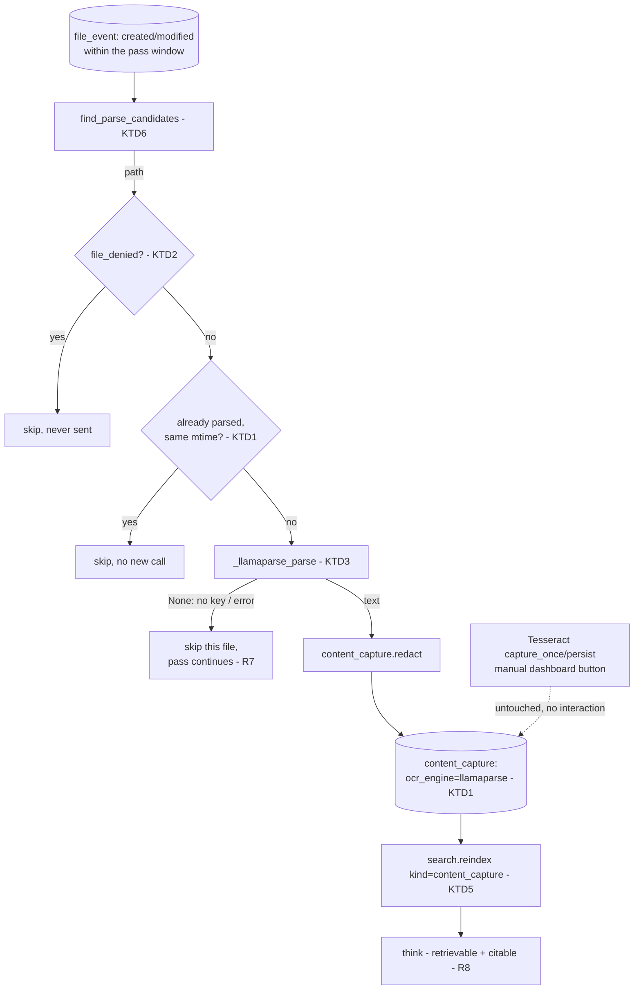

# LlamaParse Document Capture - Plan

## Goal Capsule

**Objective:** The brain's corpus includes the actual content of real documents you touch — not just their titles or a screen render — so downstream capabilities (methodology reports, proposal drafting, client outputs) have real material to work from instead of activity metadata alone.

**Means:** Add an automatic, deny-list-gated pipeline that sends files seen via `file_event` to LlamaParse, persists the parsed text, and indexes it into `search()` so `think()` can retrieve and cite it. Reuses the existing `content_capture` table and its `ocr_engine` discriminator rather than adding a new one.

**Product authority:** This plan owns document-file parsing only. It does not touch the existing Tesseract screen-OCR pipeline (stays exactly as-is: manual, dashboard-triggered, deleted-after-OCR). It does not build methodology-report generation, proposal drafting, or any other output-generation capability — those are downstream consumers of this corpus, scoped separately.

**Execution profile:** Local-first is non-negotiable everywhere else in Pulse, but this specific capability is inherently a cloud dependency — LlamaParse must see the file to parse it. The privacy boundary here is the deny-list gate (KTD2) and post-parse redaction before any further use, not a zero-key fallback. Test-first (superpowers TDD); provider calls tested with mocks, no real keys or files sent.

**Stop conditions:** Do not modify or replace the Tesseract screen-capture pipeline. Do not build any report/proposal/output-generation feature. Do not send a file that matches the deny-list.

**Open blockers:** None.

## Product Contract

### Summary

Files you actually touch (PDFs, Word docs, and similar) get parsed by LlamaParse into real text, stored, redacted, and indexed — so the brain can answer questions and eventually draft outputs grounded in what your documents actually say, not just that you opened them.

### Problem Frame

Pulse's corpus today is activity metadata: window titles, file paths, session durations. It cannot answer "what did the Gulu consultation agenda say" or "what's in this concept note" because it never reads inside a document — only that a file existed and was touched. The existing `content_capture.py` pipeline does OCR, but only of the active window's screen render (Tesseract, manual trigger, screenshot deleted immediately) — useful for "what was on my screen," useless for "what does this whole document say," since it only ever sees one rendered page or view. LlamaParse is a real document-file parser (PDF/DOCX → structured text) that can supply the actual missing layer: full document content. This is the concrete first step toward the broader vision — an assistant that can draft proposals, answer mail, and produce client outputs from real accumulated content, not just knowing what you clicked on.

### Key Decisions

- **LlamaParse parses real files seen via `file_event`; it does not touch or replace the Tesseract screen-OCR pipeline.** Two different jobs: Tesseract reads what's rendered on screen right now (ambient, ephemeral); LlamaParse reads a whole file's actual content (deliberate, persistent). (session-settled: user-directed — chosen over replacing Tesseract or building both.) Governs R1, R2, R9.
- **Triggered automatically, gated by a deny-list, not an allow-list.** Runs on a schedule like the attribution pass, parsing any touched file whose path/app/extension doesn't match a configured deny-list — opt-out by default, not opt-in. (session-settled: user-directed — chosen over manual-only or allow-list-gated, to keep the corpus growing automatically per the "morph with the data" principle.) Governs R3, R4.
- **The existing `content_capture` table is reused, not replaced.** It already has an `ocr_engine` discriminator (`"tesseract-local"` today); LlamaParse-sourced rows use `ocr_engine="llamaparse"` in the same table. Minimal schema change: add a file/source reference so a parsed file isn't re-sent on every pass. Governs R5, R8.
- **Redaction protects reuse of parsed content, not the initial LlamaParse call.** LlamaParse necessarily sees the file's real content to parse it — that exposure is what the deny-list gate manages (governs whether a file goes at all). Redaction (`content_capture.redact`, same as slice A/C) applies to the *parsed text* before it is indexed for retrieval or used in any further LLM prompt. (session-settled: user-approved — consistency with the established redact-before-reuse pattern; this plan makes explicit that it does not protect the LlamaParse call itself.) Governs R6, R7.

### Requirements

**File selection and gating**

R1. A file seen via `file_event` is a parse candidate when it matches a document type LlamaParse can handle (PDF, DOCX, and similar) — screen captures, non-document files, and the existing Tesseract pipeline's output are untouched.

R2. Parsing is decoupled from the Tesseract screen-capture pipeline: neither reads, writes, nor blocks the other, and both can be active at once without interference.

R3. A file matching a configured deny-list (path, extension, or app — mirroring `content_capture.allowed()`'s existing deny-app/deny-term shape) is never sent to LlamaParse.

R4. The deny-list is user-editable configuration, consistent with how other Pulse privacy boundaries (deny_domains, deny_terms) are already configured.

**Parsing and persistence**

R5. A successfully parsed file's text is persisted in `content_capture` with `ocr_engine="llamaparse"`, alongside a reference to the source file so re-running the pass does not re-parse an already-parsed file (unless the file has changed).

R6. Parsed text is redacted (`content_capture.redact`) before it is indexed for retrieval or included in any prompt sent to an LLM provider — the raw parsed text is never itself the retrievable/citable form.

R7. A LlamaParse failure (no key, network error, unsupported file, parse error) is caught and logged; it never blocks the pass, other files' parsing, or any unrelated Pulse function (attribution, intake, sensors).

**Corpus integration (making it usable by the brain)**

R8. Persisted, redacted document content is indexed into `search()` (mirrors slice C's `project`/`semantic_observation` pattern) so `think()` can retrieve and cite it.

R9. The existing Tesseract screen-capture pipeline (`capture_once`, `persist`, the manual dashboard trigger) is unchanged in behavior, trigger, and privacy properties.

### Acceptance Examples

AE1. **Covers R1, R3.** A recently-touched PDF outside the deny-list is parsed by (a mocked) LlamaParse and its content persisted; a PDF matching the deny-list is never sent.

AE2. **Covers R5.** Running the parse pass twice over the same unchanged file results in exactly one LlamaParse call — the second run skips the already-parsed file.

AE3. **Covers R6.** A parsed document's text containing an email address is redacted before it appears in `search_fts`'s indexed content or in any LLM prompt built from it.

AE4. **Covers R7.** A simulated LlamaParse failure for one file does not stop the pass from parsing the next eligible file, and does not affect the attribution pass or intake running in the same cycle.

AE5. **Covers R8.** After a parse pass, a `think()` question naming content unique to a parsed document's text retrieves and can cite that document.

AE6. **Covers R2, R9.** Running a full parse pass does not call, block, or alter the behavior of `capture_once`/`persist` (the Tesseract pipeline); the dashboard's manual screen-capture button still works exactly as before.

### Success Criteria

- Real document content — not just file existence — becomes part of what `think()` can ground an answer in.
- The Tesseract screen-capture pipeline shows zero behavior change (no regression).
- A re-run over unchanged files makes no new LlamaParse calls (bounded, predictable cost — same principle as slice A's R8/R11).
- No file matching the deny-list is ever sent, and no un-redacted parsed content reaches an LLM prompt.

### Scope Boundaries

**In scope:** LlamaParse integration as a new content-capture source; automatic deny-list-gated triggering; persistence into the existing `content_capture` table; redaction before reuse; indexing into `search()`; safe degradation on failure.

**Deferred for later:** methodology-report generation, proposal drafting, email drafting, or any other output-generation capability that would consume this richer corpus — each is a separate future plan (per the product vision in memory: `pulse-product-vision`).

**Outside this plan's identity:** modifying the Tesseract screen-OCR pipeline; building an allow-list-gated or manual-only trigger (explicitly rejected); a general-purpose file-parsing framework for engines other than LlamaParse.

<!-- ce-section: work-relationships -->
### How This Work Fits Together

This plan owns one area — **getting real document content into the brain's corpus.** It is the concrete first step toward the broader product vision captured in memory (`pulse-product-vision`): a smart assistant that can draft proposals, answer mail, and produce client outputs from accumulated personal data, not just activity metadata.

- **This plan — LlamaParse document capture.** Supplies the missing content layer.
  - **Methodology-report generation** (e.g. Gold Standard LSC reports). `Depends on` this plan — needs real document content (attendee lists, meeting content) that activity metadata alone cannot supply.
  - **Proposal / email / client-output drafting.** `Depends on` this plan for the same reason — any rich-content output needs rich-content input.
  - **workflows.py upgrade** (grounding the existing self-learned-method engine in attribution + the provider/retrieval layer). `Can proceed independently of` this plan — it's a metadata-pattern engine, not content-dependent — but richer content here would eventually sharpen its inferred methods too.

### Dependencies / Assumptions

- Built on the attribution backbone and slice A (provider layer, merged #32) — reuses `content_capture.redact`, `search._KINDS` extension pattern, and the nightly-pass/`run_attribution_pass` scheduling precedent. Confirmed: the `_KINDS`/`_content_query`/`reindex` extension mechanism already exists on `origin/main` independent of slice C's specific `project`/`semantic_observation` additions — this plan has no hard dependency on PR #33 merging first and branches directly off `origin/main`.
- LlamaParse API access requires a key, stored via the existing `get_secret` mechanism (per KTD6 precedent from slice A) — never plaintext config.
- `file_event`/`file_event_local` already capture the raw file paths this plan reads (per the attribution backbone's existing readers).

### Outstanding Questions

**Deferred to Implementation** (non-blocking)

- Exact document-type/extension list LlamaParse handles that this plan targets first (PDF and DOCX at minimum; broaden as needed).
- Schema shape for the file/source reference added to `content_capture` (a new column vs. a small join table) and the "file has changed" detection (mtime vs. hash).
- Where the deny-list config lives relative to the existing `deny_domains`/`deny_terms` shape in `config.yaml`.

### Sources / Research

- `workpulse/core/content_capture.py` — `redact`, `allowed` (the deny-gate pattern to mirror for R3), `capture_once`/`persist` (the existing Tesseract pipeline this plan does not touch), `ocr_engine` field (the reuse point for `"llamaparse"`).
- `workpulse/migrations/0010_content_capture.sql` — the `content_capture` table this plan extends, not replaces.
- `workpulse/web/app.py:691,715-718` — the only existing caller of `capture_once`/`persist` (a manual dashboard endpoint) — confirms today's trigger is manual-only, never scheduled.
- `workpulse/ops/nightly.py` — the existing scheduled-pass precedent (`run_attribution_pass` wiring) to mirror for R3/R4's automatic trigger.
- `docs/plans/2026-09-17-1549-feat-brain-corpus-grounding-plan.md` (slice C, U1) — the `search._KINDS` extension pattern this plan's R8 reuses.
- `docs/plans/2026-09-16-1736-feat-llm-provider-smart-features-plan.md` (slice A, KTD6/KTD7) — the `get_secret` and redact-before-reuse precedents this plan follows.
- memory `pulse-product-vision` — the broader assistant vision this plan is the first concrete step toward.
- memory `pulse-model-provider-decisions` — the original LlamaParse bet.

---

## Planning Contract

### Key Technical Decisions

KTD1. **`content_capture` gains a source-file reference column, not a new table.** The existing table (`id, ts, app, stage, redacted_text, ocr_engine, confirmed`) is extended with a nullable `source_path_hash` (mirrors `file_event.path_hash`, so no raw path is stored in the public row) and `source_mtime` (dedup signal — a changed mtime means the file changed and is eligible for re-parse). `ocr_engine="llamaparse"` distinguishes these rows from Tesseract's `"tesseract-local"` rows in the same table. Governs R5.

KTD2. **The deny-gate mirrors `content_capture.allowed()`'s shape but is file-scoped, not window-scoped.** A new `file_denied(path, cfg)` checks the path against configured deny patterns (extensions, path substrings) — same substring/casefold matching style as `allowed()`'s `DEFAULT_DENY_APPS`/`DEFAULT_DENY_TERMS`, but keyed on `content_capture.deny_paths`/`deny_extensions` config, separate from the window-focus deny list Tesseract's `allowed()` already owns. Governs R3, R4.

KTD3. **The LlamaParse adapter follows slice A's `_openai_compatible_text` shape: key-check, HTTP call, catch-and-degrade.** A `_llamaparse_parse(path, cfg)` function reads the key via `get_secret("llamaparse_key")` (KTD6-style precedent), returns `(text | None, engine_meta)`; any failure (no key, network, unsupported file, parse error) is caught and returns `None` — never raises into the caller. Governs R7.

KTD4. **All `content_capture` rows are indexed, not only LlamaParse-sourced ones.** `content_capture` is not in `search._KINDS` at all today (neither Tesseract nor LlamaParse rows are searchable) — there is no reason to index only the new source and leave existing Tesseract captures invisible. R8's `search._KINDS` addition covers the whole table, keyed on `id`/`ts`/`redacted_text`, mirroring slice C's U1 pattern exactly. Governs R8.

KTD5. **The parse pass reindexes the `content_capture` kind itself after persisting**, rather than waiting for the next unrelated cleanup/retention cycle (today's only regular `reindex()` caller) or `think()`'s empty-index heal. This closes the loop so newly parsed content is searchable the same pass it was captured, without changing `search.py`'s existing reindex cadence for other kinds. Governs R8.

KTD6. **The candidate query reads `file_event`/`file_event_local` for recent `created`/`modified` events** (never `deleted`/`moved` — nothing to parse), filtered to a small set of parseable extensions (deferred exact list to implementation) and not `file_denied`. Governs R1.

### High-Level Technical Design

Prose and IDs are authoritative; the diagram is an on-ramp.

### Assumptions and Constraints

- Never call LlamaParse for a `file_denied` path (KTD2/R3) or a file already parsed at its current mtime (KTD1/R5).
- A LlamaParse failure never raises past `_llamaparse_parse`'s boundary and never stops the pass, other files, or any unrelated Pulse function (R7).
- The pass never touches `capture_once`/`persist`/the manual dashboard endpoint (R9) — verified by their tests staying green unmodified.
- No raw file path leaves the public `content_capture` row (hashed, mirroring `file_event.path_hash`'s existing privacy shape).

### Sequencing

U1 (deny-gate + adapter) and U2 (schema migration) are independent and can proceed in parallel. U3 (candidate selection + persistence) depends on U1 and U2. U4 (search indexing + nightly wiring) depends on U3. Build on a fresh branch cut from `origin/main`.

---

## Implementation Units

### U1. Deny-gate and LlamaParse adapter

- **Goal:** A file-scoped deny check and a degrade-safe LlamaParse call, with no side effects yet.
- **Requirements:** R3, R4, R7.
- **Dependencies:** none.
- **Files:** `workpulse/core/content_capture.py`, `tests/test_content_capture.py` (existing or new).
- **Approach:**
  1. Add `file_denied(path: str, cfg: dict) -> tuple[bool, str]` reading `cfg["content_capture"]["deny_paths"]`/`["deny_extensions"]`, substring/casefold matched against the path — same style as `allowed()`'s existing deny check (KTD2).
  2. Add `_llamaparse_key(cfg)` (env-or-`get_secret("llamaparse_key")`, mirrors `_glm_key`/`_deepseek_key` from slice A) and `_llamaparse_parse(path, cfg) -> tuple[str | None, dict]` — no key or any HTTP/parse failure returns `(None, meta)`, never raises (KTD3).
- **Patterns to follow:** `content_capture.allowed()` for the deny shape; `workpulse/core/llm.py`'s `_openai_compatible_text`/`_glm_key` for the key-check-then-call-then-degrade shape.
- **Test scenarios:**
  - A path matching a configured deny extension/substring is denied; a non-matching path is not.
  - With no `llamaparse_key` configured, `_llamaparse_parse` returns `(None, meta)` without attempting a call.
  - A mocked successful LlamaParse response returns the parsed text.
  - A mocked HTTP failure (timeout, non-200, malformed response) returns `(None, meta)` without raising.
- **Verification:** deny-gate and adapter behave correctly in isolation, no network calls in tests.

### U2. Schema: source reference on `content_capture`

- **Goal:** Let a `content_capture` row reference the file it came from, for dedup.
- **Requirements:** supports R5.
- **Dependencies:** none.
- **Files:** `workpulse/migrations/0012_content_capture_source.sql` (new), `tests/test_content_capture_schema.py` (new, mirrors slice A backbone's U1 schema test shape).
- **Approach:**
  1. Additive migration: `ALTER TABLE content_capture ADD COLUMN source_path_hash TEXT`, `ADD COLUMN source_mtime TEXT`. Both nullable — existing Tesseract rows keep them `NULL` (never sourced from a file).
- **Patterns to follow:** migration `0011_project_attribution.sql`'s additive `ALTER TABLE` style.
- **Test scenarios:**
  - Migration applies on a copy of the live DB without losing existing `content_capture` rows; re-applying is a no-op (idempotent) — same shape as the backbone's U1 gate.
  - A new row can be written with `source_path_hash`/`source_mtime` set and read back.
- **Verification:** migration applies cleanly on a live-DB copy; existing Tesseract rows unaffected.

### U3. Candidate selection, parsing, and persistence

- **Goal:** Find eligible recently-touched files, parse the undenied/unparsed ones, redact, and persist.
- **Requirements:** R1, R2, R5, R6.
- **Dependencies:** U1, U2.
- **Files:** `workpulse/core/content_capture.py`, `tests/test_content_capture.py`.
- **Approach:**
  1. `find_parse_candidates(con, cfg, *, since) -> list[dict]`: query `file_event`/`file_event_local` for `kind IN ('created','modified')` within the window, extension-filtered to a small parseable set (deferred exact list), excluding `file_denied` paths and paths already in `content_capture` at their current mtime (KTD1/KTD6).
  2. `parse_and_persist(con, cfg) -> dict`: for each candidate, call `_llamaparse_parse`; on success, `redact(text, cfg["content_capture"].get("redaction_terms") or [])` (R6, matching `capture_once`'s existing call shape) and `INSERT` into `content_capture` with `ocr_engine="llamaparse"`, `source_path_hash`, `source_mtime`; on failure, skip and continue (R7). Returns counts (parsed, skipped, denied, failed).
- **Patterns to follow:** `attribution.attribute_all`'s batch/skip-on-failure shape; `content_capture.persist`'s insert style.
- **Test scenarios:**
  - Covers AE1. A candidate file outside the deny-list is parsed (mocked) and persisted; a denied file is never sent to `_llamaparse_parse`.
  - Covers AE2. Running the pass twice over the same unchanged file results in exactly one `_llamaparse_parse` call.
  - Covers AE3. Persisted `redacted_text` never contains a sensitive substring present in the mocked raw parsed text.
  - Covers AE4. A mocked failure for one candidate does not stop the pass from processing the next candidate.
  - A `deleted`/`moved` file_event is never a candidate.
- **Verification:** on a copy of the live DB with mocked LlamaParse, the pass parses eligible files, persists redacted rows, and a second run makes zero new calls.

### U4. Search indexing and nightly wiring

- **Goal:** Parsed content is retrievable/citable via `think()`, and the pass runs automatically without blocking anything else.
- **Requirements:** R8, R9.
- **Dependencies:** U3.
- **Files:** `workpulse/core/search.py`, `workpulse/ops/nightly.py`, `tests/test_search.py`, `tests/test_nightly.py`.
- **Approach:**
  1. Add `"content_capture"` to `search._KINDS` with a `_content_query` branch over the whole table (both engines, KTD4): `content = redacted_text`, `ts = ts`, `stream = NULL`.
  2. In `parse_and_persist` (or its nightly caller), after persisting, call `search.reindex(con, kinds=["content_capture"])` so new rows are searchable immediately (KTD5).
  3. Wire `parse_and_persist` into `workpulse/ops/nightly.py`'s daily block, guarded exactly like `attribution.run_attribution_pass` (`try`/`except Exception`, recorded in `did`, never raises past the guard) — R9's untouched-Tesseract requirement is satisfied by never calling `capture_once`/`persist` anywhere in this unit.
- **Patterns to follow:** slice C's U1 `_content_query` branch shape; `nightly.py:127-130`'s attribution try/except guard verbatim.
- **Test scenarios:**
  - Covers AE5. After persisting a parsed document via the test fixture, `search.search()` returns it, and `think()`'s retrieval includes it.
  - Covers AE6. Running the nightly daily block with a mocked `parse_and_persist` does not call, and does not change the behavior of, `capture_once`/`persist` — the existing Tesseract-path tests stay green unmodified.
  - A simulated `parse_and_persist` exception is caught by the nightly guard and does not stop `consolidate`/`report`/`profile` from running.
- **Verification:** the existing 6+ `content_capture`-adjacent Tesseract tests (manual dashboard path) pass unmodified; a real (mocked) end-to-end run makes new document content answerable via `think()`.

---

## Verification Contract

- **Test runner:** `.venv/bin/python -m pytest`. Run each unit's test file, then the full suite before done.
- **No-regression gate (load-bearing):** every existing test exercising `capture_once`/`persist`/the manual dashboard capture endpoint passes unmodified after U3/U4 (R9).
- **Deny gate:** a file matching the deny-list is never passed to `_llamaparse_parse` (AE1/R3).
- **Dedup/cost gate:** two consecutive passes over the same unchanged file make exactly one LlamaParse call (AE2/R5) — same idempotency discipline as the attribution backbone's R8.
- **Redaction gate:** persisted `redacted_text` and any indexed/prompt-bound copy never contain a sensitive substring present in raw parsed text (AE3/R6).
- **Degradation gate:** a LlamaParse failure for one file never stops the pass, other files, or the nightly rollup (AE4/R7).
- **Growth gate:** parsed, persisted, redacted content becomes retrievable and citable via `search()`/`think()` in the same pass it was captured (AE5/R8).
- **Provider isolation:** all LlamaParse calls in tests are mocked HTTP; no real network calls or keys.

---

## Definition of Done

**Prerequisite:** work happens on a branch cut from `origin/main` (no dependency on slice C/PR #33 merging first).

**Global:**
- All Implementation Units complete with their test files green, and the full `pytest` suite green.
- The no-regression gate holds — every existing Tesseract-path test passes unmodified (R9).
- The deny, dedup/cost, redaction, and degradation gates all pass (R3/R5/R6/R7).
- Parsed document content is retrievable and citable via `think()` (R8; Success Criteria).
- LlamaParse keys are read only via `get_secret` (KTD3); no key or raw file path is hardcoded, logged, or stored unhashed.
- No dead-end or experimental code remains in the diff.

**Per-unit:** each unit's own **Verification** line is met.
