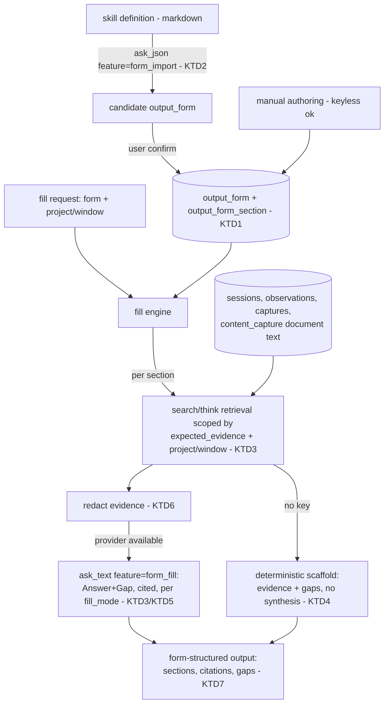

# Corpus-Grounded Output Forms - Plan

## Goal Capsule

**Objective:** When you need a defined output — a stakeholder-engagement report, a proposal section, a client update — Pulse produces it in the required form, filled from your corpus with every claim cited to its source and anything unsupported flagged as an explicit gap rather than invented. The form's structure and manner are defined once (seedable from an existing skill); Pulse supplies the accurate data.

**Means:** A form registry (a defined output form: its sections, each section's expected evidence, and a per-form fill mode), seedable from a skill definition, plus a fill engine that retrieves the relevant corpus per section (slice C's `search()`/`think()`) and drafts via slice A's provider layer — reusing `report.py`'s evidence-packet-plus-fallback pattern rather than inventing a new one.

**Product authority:** This plan owns the form registry and the corpus-fill engine, proven end-to-end on one real form. Adding further forms (proposal, email, status) is later registry data, not new code. Pulse does not re-encode external compliance rules — the adopted skill keeps form/manner authority; Pulse holds data/accuracy authority.

**Execution profile:** Accuracy is the whole point — a fabricated attendee list in a compliance document is worse than a blank one. Every filled claim cites its corpus source; unsupported form requirements are flagged, never inferred into existence (except where a form's fill mode explicitly opts into inference, and even then flagged). Local-first is non-negotiable: with no provider key, fill still produces the structured, cited, gap-marked scaffold deterministically. Test-first (superpowers TDD).

**Stop conditions:** Do not re-encode compliance validation (date math, category-code completeness, section rules) — that stays in the adopted skill. Do not auto-submit or send any output. Do not build a form-authoring UI beyond what the fill flow needs.

**Open blockers:** None on scope. One sequencing dependency: the fill engine needs the corpus that slices B (#34, document content) and C (#33, project/observation grounding + retrieval) add — see Dependencies.

## Product Contract

### Summary

Pulse gains a registry of defined output forms (seedable from a skill) and an engine that fills a chosen form from the corpus — grounded, cited, gaps flagged — so producing a required document becomes "fill the defined form from what I've actually done," not free-form drafting and not manual assembly.

### Problem Frame

Pulse now holds a rich corpus — attributed sessions, workflow observations, user captures, and (via slice B) parsed document content, all retrievable via slice C. But it cannot yet turn that corpus into a *required output*. `report.py` proves the "evidence packet → LLM → markdown" shape, but only for one hardcoded report type (time summaries), on the old pre-provider-layer call path, without retrieval. The user's need is broader and stricter: an output is produced against a *defined form* (the "right manner"), filled *accurately* from the data, where the form definition can be seeded from a skill he already has (e.g. the external `lsc-report` skill that encodes Gold Standard compliance). The danger to design against is confident fabrication: in a stakeholder-engagement or compliance document, an invented name or date is a finding, not a convenience. So the form defines what is required; Pulse fills only what the corpus supports and says so where it can't.

### Key Decisions

- **A form is defined data, not hardcoded, and is seedable from a skill definition.** A form definition (sections + per-section expected evidence + fill mode) lives in the registry; it can be proposed by importing an existing skill's structure and confirmed before use (candidate → confirmed, reusing the established lifecycle). (session-settled: user-directed — chosen over a free-form generate verb and over Pulse-only form authoring: "the form required has to be defined and skills adopted by pulse".) Governs R1, R2, R3.

- **Fill behavior is configurable per form.** Each form declares a fill mode — strict-evidence (fill only what the corpus supports, flag the rest as gaps) or full-draft (infer plausible content for gaps, flagged by confidence). Both cite sources. (session-settled: user-directed — chosen over a single global fill behavior.) Governs R5, R7.

- **Accuracy authority is Pulse's; form/manner authority is the adopted skill's.** Pulse fills a form with cited corpus content and explicit gaps; it does not validate the skill's compliance rules (date math, category-code completeness). Those stay in the adopted skill, which finalizes. (session-settled: user-directed — "pulse holds the data … skills adopted … to ensure it provides the required information accurately".) Governs R6, R7, R11.

- **Reuse the existing generation spine; do not rebuild it.** The fill engine composes per-section evidence packets (extending `report.py`'s `_packet` pattern), retrieves via slice C's `search()`/`think()`, and drafts via slice A's `ask_text(feature=...)` — with a deterministic no-key fallback (structure + citations + gaps). (session-settled: user-approved.) Governs R4, R8, R9, R10.

### Requirements

**Form registry**

R1. A form definition is stored as data: an id/name, an ordered set of sections, each section's expected evidence (what the corpus must supply to fill it), and a fill mode (strict-evidence or full-draft).

R2. A form definition can be seeded by importing an existing skill definition: the skill's structure is read and proposed as a candidate form (sections + expected evidence), which the user confirms before it is usable (candidate → confirmed).

R3. Form definitions are editable and versioned; confirming or editing a form never silently changes outputs already produced from an earlier version.

**Corpus fill**

R4. Filling a chosen form retrieves the relevant corpus per section — attributed sessions, workflow observations, captures, and parsed document content — via the existing retrieval layer, scoped to a project and/or time window when the form or request specifies one.

R5. Each section is filled according to the form's fill mode: strict-evidence fills only what the corpus supports; full-draft additionally infers content for unmet expectations, marked as inferred.

R6. Every filled claim cites the corpus source it came from (atom ids / document references), so any statement can be traced back to evidence.

R7. A section whose expected evidence the corpus does not supply is rendered as an explicit gap ("no evidence for …"), never silently filled — in strict-evidence mode always, and in full-draft mode inferred content is still flagged as unverified.

R8. The output is rendered in the form's defined section structure and manner, ready for the adopted skill or the user to finalize.

**Provider and local-first**

R9. Drafting uses slice A's provider layer (`ask_text`/`ask_json`, feature-routed), so the model is configurable per the existing per-feature routing; redaction applies before any cloud call, consistent with the established pattern.

R10. With no provider key, fill still produces the form's structured output — sections, cited evidence, and explicit gaps — deterministically, without prose synthesis and without fabricating anything.

**Boundary**

R11. Pulse does not validate or enforce the adopted skill's compliance rules (date-window math, mandatory-category completeness, section-order rules); its output is a grounded draft/scaffold that the skill or the user validates and finalizes.

### Acceptance Examples

AE1. **Covers R7 (strict).** A strict-evidence form section whose expected evidence is absent from the corpus renders an explicit gap marker, not invented text.

AE2. **Covers R6.** A filled claim in an output carries the atom id(s) / document reference it was drawn from.

AE3. **Covers R2.** Importing an existing skill definition proposes a candidate form carrying that skill's sections and expected evidence; confirming it makes the form usable.

AE4. **Covers R5.** The same corpus and form filled in strict-evidence mode marks a gap where full-draft mode instead emits inferred-and-flagged content.

AE5. **Covers R10.** With no provider key configured, filling a form still produces its sectioned output with citations and gap markers.

AE6. **Covers R4 (document content).** A form section whose expected evidence is document content (e.g. a meeting attendee list) is filled from a parsed `content_capture` (slice B) row and cited.

### Success Criteria

- Producing a required output becomes "fill the defined form from the corpus," with every claim traceable to a source and every unmet requirement visibly flagged.
- No output ever contains an unsupported claim presented as verified (the fabrication-safety property holds in both fill modes).
- A no-key install still produces the cited, gap-marked scaffold (no regression from the local-first guarantee).
- Adding a second form (e.g. a proposal or status update) requires a new registry entry and no engine change.

### Scope Boundaries

**In scope:** the form registry; seeding a form from a skill definition (propose + confirm); the corpus-fill engine with per-section retrieval, per-form fill mode, source citation, and explicit gap flagging; provider-layer drafting with a deterministic no-key scaffold — proven end-to-end on one real form.

**Deferred for later:** additional forms as registry data (proposal, email, client status) once the engine exists; a form-authoring/editing UI beyond the fill flow; batch/multi-form generation; the `workflows.py` self-learned-method upgrade (adjacent, separate).

**Outside this plan's identity:** re-encoding any external compliance logic (Gold Standard date math, category codes) — that stays in the adopted skill; auto-sending or submitting outputs; validating a produced document as compliant.

<!-- ce-section: work-relationships -->
### How This Work Fits Together

This plan owns one area — **turning the corpus into a defined output form, accurately**. It is the payoff layer of the product vision in memory (`pulse-product-vision`): the general output-generation capability of which methodology reports, proposals, and client outputs are all instances.

- **This plan — corpus-grounded output forms.** The registry + fill engine.
  - **Methodology/compliance reports (e.g. Gold Standard LSC).** `Uses` this plan by importing the external `lsc-report` skill as a form; the skill keeps compliance authority, Pulse supplies grounded content.
  - **Proposals, email, client status outputs.** `Use` this plan — each is another form in the registry, no engine change.
  - **`workflows.py` self-learned-method upgrade.** `Can proceed independently`; a learned method could eventually seed a form, but that is not required here.

### Dependencies / Assumptions

- **Sequencing dependency (real):** the fill engine's retrieval needs slice C (#33 — `search()`/`think()` grounded in `project`/`semantic_observation`) and slice B (#34 — `content_capture` indexed document content). The build should branch off a base that includes both (i.e. after #33 and #34 merge to `main`, or a combined base). This plan does not need to re-implement any of their retrieval.
- Reuses: `report.py`'s `_packet`/`_fallback` evidence-and-fallback pattern; slice A's `ask_text`/`ask_json` + redaction; slice C's `search`/`think`; the `workflow_method` schema (`output_type`, per-step `expected_evidence`) as a candidate home for form definitions.
- Provider keys via the existing `get_secret` mechanism; local-first fallback per PLAN.md.

### Outstanding Questions

**Deferred to Implementation** (non-blocking)

- Exact prompt shape for import (how much of a skill's prose becomes each section's `expected_evidence` descriptor). (R2; KTD2.)
- The precise inline citation/gap markup in rendered markdown (e.g. `[atom:<id>]` and `> GAP: …`). (R6, R7, R8; KTD3/KTD4.)
- The first end-to-end proof form: the `lsc-report` engagement form is the intended candidate (it exists as an importable skill), but any one real form satisfies the Definition of Done.

### Sources / Research

- `workpulse/core/report.py` — `_packet` (evidence-packet construction), `_fallback_daily`/`_fallback_weekly` (no-LLM rendering), `daily`/`weekly` (the generation spine to generalize, currently on the old `think._call_anthropic` path).
- `workpulse/core/think.py` / `search.py` (slice C, #33) — retrieval + the Answer/Gap citation discipline this plan applies per form section.
- `workpulse/core/content_capture.py` (slice B, #34) — parsed document content, now a `search._KINDS` atom kind, the new evidence source for content-heavy form sections.
- `workpulse/core/llm.py` (slice A) — `ask_text`/`ask_json(feature=...)` provider layer + `content_capture.redact` for the drafting path.
- `workpulse/core/workflows.py` + `workpulse/migrations/0008_workflow_memory.sql` — `workflow_method.output_type` / `workflow_step.expected_evidence`, a candidate schema home for form definitions.
- External `lsc-report` SKILL.md (installed Claude skill, not in the repo) — the exemplar importable form; keeps Gold Standard compliance authority. Referenced, never re-encoded.
- memory `pulse-product-vision` — the broad output-generation vision this plan realizes.

---

## Planning Contract

### Key Technical Decisions

KTD1. **New `output_form` + `output_form_section` tables, not `workflow_method` reuse.** `workflow_method`/`workflow_step` model *learned* methods (process steps with `action_type`, inferred from behavior); a form is an *adopted definition* (sections with expected evidence and a fill mode). Overloading the learned-method tables would conflate two distinct concepts and force a `fill_mode` onto a schema that has no place for it. The new tables mirror workflow_method/step's familiar shape (a parent + ordered children with `expected_evidence`) but stay semantically their own thing. (session-settled: user-approved — dedicated home chosen over overloading `workflow_method`.) Governs R1, R3.

KTD2. **Import-from-skill = LLM proposes a candidate form from the skill's text; the user confirms.** A skill definition (markdown) is sent to `ask_json(feature="form_import")`, which returns a proposed `{name, sections:[{name, expected_evidence}], fill_mode}`; it is stored `status='candidate'` and becomes usable only on confirm (candidate → confirmed, the established lifecycle). Structural parsing of arbitrary skill prose is not attempted — the model reads it. Import needs a model (it cannot run keyless); the keyless degradation is that manual form authoring (R1) still works. Governs R2.

KTD3. **The fill engine is per-section Answer+Gap, mirroring `think()`.** For each form section, compose a section evidence packet — retrieve via `search()`/`think()` scoped to the request's project/window, using the section's `expected_evidence` as the query — then draft that one section via `ask_text(feature="form_fill")` under an Answer+Gap contract (like `skills/think.md`): every claim cites its atom id(s), and any expected evidence the corpus does not supply is written as an explicit gap. This reuses the retrieval + citation discipline slice C already established, applied section-by-section. Governs R4, R6, R7, R8.

KTD4. **The keyless fallback is a deterministic scaffold, reusing `report.py`'s `_fallback` shape.** With no provider (or `ask_text` returning `(None, meta)`), each section renders its header, the retrieved evidence (atom ids + short snippets), and an explicit gap marker for every unmet expected-evidence item — with no prose synthesis and nothing inferred. This is the fabrication-safety floor: keyless output is always structure + citations + gaps. Governs R10.

KTD5. **`fill_mode` is a column on `output_form`; it changes only whether unmet evidence may be inferred, never whether claims are cited.** `strict` never emits an uncited or unsupported statement (unmet → gap). `full-draft` additionally emits inferred content for unmet items, each explicitly tagged as inferred/unverified; supported claims are cited identically to strict. (session-settled: user-directed — per-form fill behavior.) Governs R5, R7.

KTD6. **Redaction applies before the cloud draft, reusing slice A/C's boundary.** Each section evidence packet's atom content passes through `content_capture.redact` before it enters the `ask_text` prompt; the retrieved atoms returned to the caller and the keyless scaffold keep raw content. Governs R9.

KTD7. **Compliance validation is out; Pulse renders the form's structure and stops.** Pulse produces the sectioned, cited, gap-marked output; it never checks date-window math, category-code completeness, or section-order rules — those stay with the adopted skill, which finalizes. Governs R11.

### High-Level Technical Design

Prose and IDs are authoritative; the diagram is an on-ramp.

### Assumptions and Constraints

- No output ever presents an unsupported claim as verified, in either fill mode (the fabrication-safety property; KTD4/KTD5).
- Keyless installs never call a provider and never fabricate — they get the scaffold (KTD4, R10).
- Pulse never validates the adopted skill's compliance rules (KTD7, R11).
- Reuse over rebuild: retrieval is slice C's, drafting is slice A's, the evidence-packet + fallback shape is `report.py`'s — this plan adds the form registry and the per-section orchestration, not new retrieval or a new provider path.

### Sequencing

U1 (schema + registry) first. U2 (import) and U3 (section retrieval) both depend on U1 and are independent of each other. U4 (fill engine) depends on U1 + U3. U5 (surface) depends on U4. Build on a fresh branch cut from `origin/main` (which now carries slices A/B/C).

---

## Implementation Units

### U1. Form registry: schema + CRUD

- **Goal:** Store and retrieve form definitions (sections + expected evidence + fill mode), with a confirm lifecycle.
- **Requirements:** R1, R3.
- **Dependencies:** none.
- **Files:** `workpulse/migrations/0013_output_forms.sql` (new), `workpulse/core/output_forms.py` (new), `tests/test_output_forms.py` (new).
- **Approach:**
  1. Migration: `output_form(id, name, source_skill, fill_mode CHECK('strict','full-draft'), status CHECK('candidate','confirmed','dismissed'), version, created_at, confirmed_at)` and `output_form_section(id, form_id, position, name, expected_evidence, required, UNIQUE(form_id, position))` — shape mirrors `workflow_method`/`workflow_step` (KTD1).
  2. `create_form`, `add_section`, `get_form` (with sections ordered), `list_forms`, `confirm_form` (candidate → confirmed, sets `confirmed_at`).
- **Patterns to follow:** `workpulse/migrations/0011_project_attribution.sql` (additive/idempotent); the project `candidate → confirmed` correction lifecycle.
- **Test scenarios:**
  - Migration applies on a live-DB copy and re-applies as a no-op (idempotent).
  - A form with ordered sections is created and read back in order.
  - `confirm_form` flips status and stamps `confirmed_at`; a dismissed/candidate form is distinguishable from a confirmed one.
- **Verification:** registry round-trips a multi-section form; migration clean on a live-DB copy.

### U2. Import a form from a skill definition

- **Goal:** Propose a candidate form from a skill's markdown, for the user to confirm.
- **Requirements:** R2.
- **Dependencies:** U1.
- **Files:** `workpulse/core/output_forms.py`, `tests/test_output_forms.py`.
- **Approach:**
  1. `import_form_from_skill(con, skill_text, cfg) -> form_id | None`: send `skill_text` to `ask_json(feature="form_import")`; expect `{name, fill_mode, sections:[{name, expected_evidence}]}`; persist as a `candidate` form + sections (KTD2).
  2. No provider → return `None` (import needs a model); manual authoring (U1) remains the keyless path.
- **Patterns to follow:** slice C's `discovery.refine_taxonomy` (ask_json guarded by provider availability, malformed response is a no-op).
- **Test scenarios:**
  - Covers AE3. A mocked `ask_json` returning a form spec creates a `candidate` form carrying those sections; confirming makes it usable.
  - With no provider, `import_form_from_skill` returns `None` and writes nothing.
  - A malformed/None model response writes nothing (no partial form).
- **Verification:** a mocked skill import yields a confirmable candidate form; keyless import is a clean no-op.

### U3. Section retrieval + evidence packet

- **Goal:** For a form section, gather the corpus evidence relevant to its expected evidence, scoped by project/window.
- **Requirements:** R4.
- **Dependencies:** U1.
- **Files:** `workpulse/core/output_forms.py`, `tests/test_output_forms.py`.
- **Approach:**
  1. `section_evidence(con, section, *, project=None, since=None, cfg=None) -> list[dict]`: query `search.search()` using the section's `expected_evidence` as the query text, scoped by `since`; keep retrieved atoms (session/observation/capture/content_capture) with their ids for citation.
  2. Optionally bias toward a named project (the corpus is already project-woven via slice C, so a project-scoped request surfaces its atoms through ordinary relevance).
- **Patterns to follow:** `think()`'s retrieval call into `search.search()` + `_diverse` de-duplication.
- **Test scenarios:**
  - A section whose expected evidence matches a seeded document (`content_capture`) retrieves that atom (AE6 groundwork).
  - A section with no matching corpus returns an empty evidence list (feeds the gap path).
  - Scoping by `since` excludes out-of-window atoms.
- **Verification:** section retrieval returns citable atoms spanning corpus kinds including parsed documents.

### U4. Fill engine: draft, cite, gap-flag, with keyless scaffold

- **Goal:** Produce the form's sectioned output — cited where supported, gaps flagged, per fill mode — with a deterministic keyless fallback.
- **Requirements:** R5, R6, R7, R8, R9, R10, R11.
- **Dependencies:** U1, U3.
- **Files:** `workpulse/core/output_forms.py`, `workpulse/skills/form_fill.md` (new, the Answer+Gap-per-section contract), `tests/test_output_forms.py`.
- **Approach:**
  1. `fill_form(con, form_id, *, project=None, since=None, cfg=None) -> dict`: for each section, get `section_evidence` (U3), redact it (KTD6), and if a provider is available draft the section via `ask_text(feature="form_fill")` under the Answer+Gap contract honoring the form's `fill_mode` (KTD3/KTD5); else render the deterministic scaffold (KTD4).
  2. Assemble sections into the form's structure; return `{markdown, sections:[{name, body, citations, gaps}], mode, fallback}`.
  3. Never validate compliance rules (KTD7).
- **Patterns to follow:** `think()` (ask_text(feature=...) + Answer/Gap split + `_fallback`); `report.py` `_fallback_*` for deterministic rendering.
- **Test scenarios:**
  - Covers AE2. A filled claim carries the atom id it came from.
  - Covers AE1. A strict-mode section with no supporting evidence renders an explicit gap, never invented text (assert no uncited prose).
  - Covers AE4. The same section+corpus yields a gap in strict mode and inferred-and-flagged content in full-draft mode.
  - Covers AE5. With no provider key, `fill_form` returns the scaffold (`fallback=True`) with citations + gaps and no synthesized prose.
  - Covers AE6. A section requiring document content is filled from a `content_capture` atom and cited.
  - The prompt sent to a mocked provider carries redacted evidence, not raw (R9).
- **Verification:** end-to-end fill of a confirmed multi-section form produces cited output with gaps; keyless path produces the scaffold; strict mode never fabricates.

### U5. Surface: run a fill end-to-end

- **Goal:** Let the user import/confirm a form and fill it from the corpus.
- **Requirements:** supports R2, R8 (makes the capability usable).
- **Dependencies:** U4.
- **Files:** `workpulse/cli.py`, `workpulse/web/app.py`, `tests/test_output_forms.py` (or an app test).
- **Approach:**
  1. CLI: `workpulse form import <skill-file>`, `workpulse form list`, `workpulse form fill <form-id> [--project X] [--since D]` (prints the rendered markdown).
  2. A thin dashboard endpoint mirroring the CLI fill (`GET /api/forms`, `POST /api/forms/{id}/fill`).
- **Patterns to follow:** slice A's `cmd_attribute` CLI addition; the existing `workpulse/web/app.py` project endpoints from slice C.
- **Test scenarios:**
  - The fill endpoint/command returns a confirmed form's rendered output for a project.
  - Filling an unknown or unconfirmed form is rejected cleanly (not a 500).
- **Verification:** a form can be imported, confirmed, and filled from the CLI end-to-end against a seeded corpus.

---

## Verification Contract

- **Test runner:** `.venv/bin/python -m pytest`. Run each unit's test file, then the full suite before done.
- **Fabrication-safety gate (load-bearing):** in strict mode, no section ever emits an uncited or unsupported statement — unmet expected evidence is always a gap (AE1); in full-draft mode, inferred content is always tagged unverified (AE4). A test asserts the strict-mode output contains no prose beyond cited claims + gap markers.
- **Keyless gate:** with no provider key, `fill_form` returns the deterministic scaffold — sections + citations + gaps, `fallback=True`, no synthesized prose, nothing fabricated (AE5/R10).
- **Citation gate:** every supported claim carries its atom id(s) (AE2/R6).
- **Redaction gate:** the prompt sent to a mocked provider carries redacted evidence, never raw (R9).
- **Document-content gate:** a section requiring document content is filled from a `content_capture` atom and cited (AE6/R4).
- **Import gate:** a mocked skill import yields a confirmable candidate; a keyless or malformed import writes nothing (AE3/R2).
- **Provider isolation:** all provider calls in tests are mocked; no real network or keys.
- **Boundary:** no test expects Pulse to validate compliance rules (dates, category completeness) — that is out of scope (R11).

---

## Definition of Done

**Prerequisite:** work happens on a fresh branch cut from `origin/main` (which now carries slices A/B/C).

**Global:**
- All Implementation Units complete with their test files green, and the full `pytest` suite green.
- The fabrication-safety gate holds — no output presents an unsupported claim as verified, in either fill mode.
- The keyless gate holds — a no-provider install produces the cited, gap-marked scaffold (R10; local-first preserved).
- One real form is imported, confirmed, and filled end-to-end from the corpus (including a document-content section), with citations and gaps (Success Criteria).
- Adding a second form requires only a new registry entry, no engine change (Success Criteria) — demonstrated by a second seeded form in tests filling through the same engine.
- Provider keys via `get_secret` only; redaction before every cloud draft (KTD6); no compliance logic re-encoded (KTD7).
- No dead-end or experimental code remains in the diff.

**Per-unit:** each unit's own **Verification** line is met.
